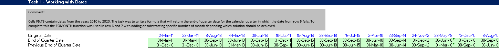
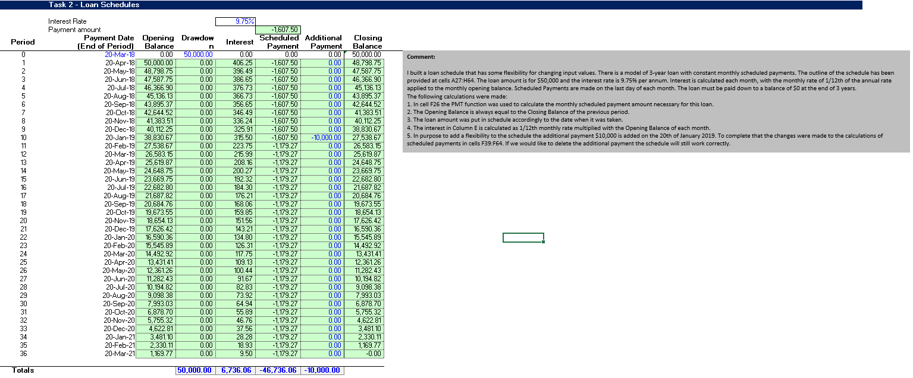
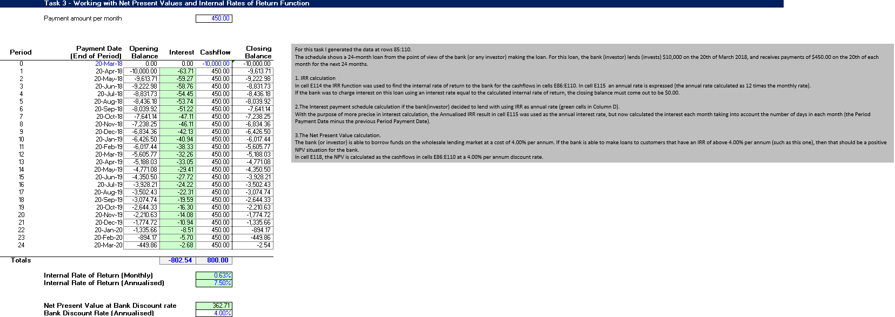
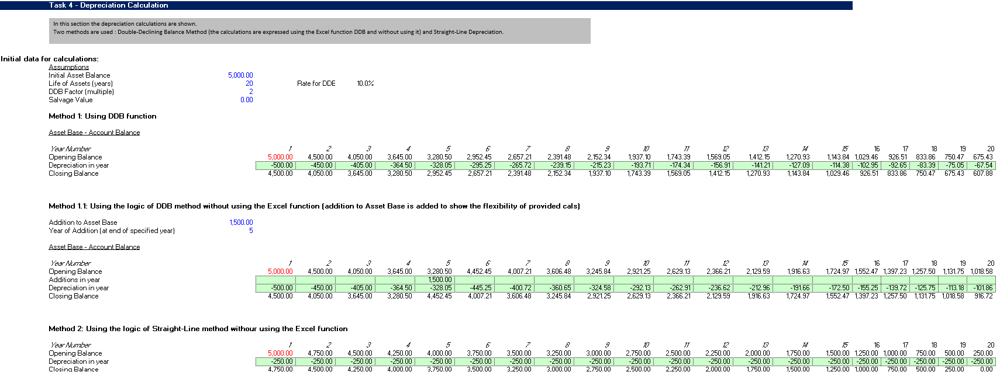

# Financial Modeling in Microsoft Excel

## Project Overview

This project demonstrates practical financial modeling techniques in Microsoft Excel using built-in financial functions and custom calculations.

The workbook includes loan amortization schedules, investment evaluation using NPV and IRR, depreciation modeling, and date calculations commonly used in financial analysis.

---

## Business Objective

The objective of this project is to demonstrate practical financial analysis skills by developing Excel models that support investment evaluation, loan planning, asset depreciation, and financial decision-making.

---

## Excel Topics Covered

The workbook includes the following financial models:

- Working with Date Functions
- Loan Amortization Schedule
- Net Present Value (NPV)
- Internal Rate of Return (IRR)
- Double Declining Balance (DDB) Depreciation
- Straight-Line Depreciation

---

## Excel Functions Used

### Financial Functions

- PMT
- NPV
- IRR
- DDB

### Date Functions

- EOMONTH
- DATE
- YEAR
- MONTH

### Additional Functions

- IF
- SUM
- ROUND
- ABS

---

## Workbook Preview

### Working with Dates



---

### Loan Amortization Schedule



---

### Net Present Value & Internal Rate of Return



---

### Depreciation Calculation



---

## Key Skills Demonstrated

- Financial Modeling
- Investment Analysis
- Loan Amortization
- Discounted Cash Flow Analysis
- Asset Depreciation
- Financial Functions in Excel
- Scenario-based Calculations
- Business Problem Solving

---

## Repository Structure

```text
financial-modeling-excel/
│
├── model/
│   └── financial_modeling.xlsx
│
├── images/
│   ├── working_with_dates.png
│   ├── loan_schedules.png
│   ├── npv_irr_analysis.png
│   └── depreciation_calculation.png
│
└── README.md
```

---

## Author

**Viktoryia Vashkevich**

Business & Financial Analyst transitioning into Data Analytics

📍 Massachusetts, USA

**Technical Skills**

- Microsoft Excel
- Financial Modeling
- NPV
- IRR
- PMT
- Data Analysis
- Business Analysis

**LinkedIn**

https://www.linkedin.com/in/viktoryia-vashkevich-147702261/
